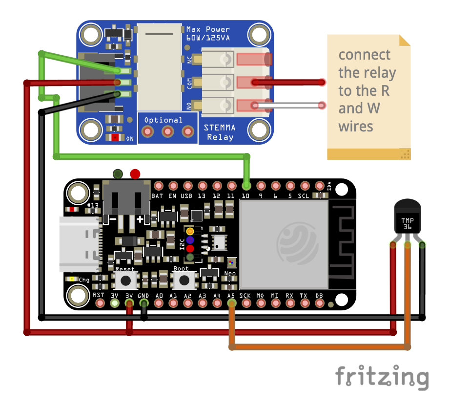
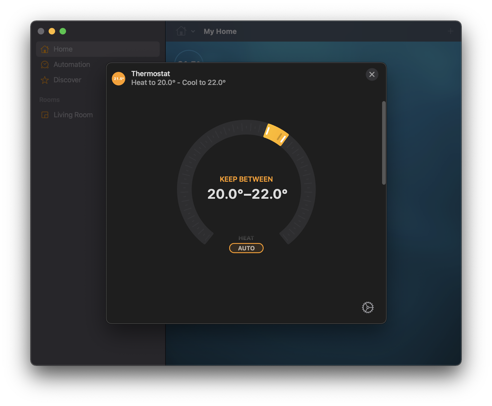

# HomeSpan Thermostat

HomeKit connected smart thermostat based on Arduino using [HomeSpan](https://github.com/HomeSpan/HomeSpan).

## Background and Motivation

I have a 24 V Heat-only system with a 2-wire system (No C wire, only R and W). It used a manual
Honeywell single-point thermostat. I wanted to get the functionalities of a HomeKit compatible
smart thermostat without the hassle of installing a C wire myself and/or having to buy an
expensive smart thermostat. So I created my own with a Wi-Fi capable microcontroller.

## Hardware

I used a [Adafruit ESP32-S2 Feather](https://www.adafruit.com/product/5000) board, along with
a [TMP36](https://www.adafruit.com/product/165) analog temperature sensor, and a
[simple non-latching relay](https://www.adafruit.com/product/4409).

I wired up the TMP36 to an analog input pin (`A5` i.e `8`) and the relay to a digital pin (`10`),
and connected the relay to the R and W wires in my heating panel in the `NO` mode i.e when the relay is
`off`, the heater is also `off`. The circuit diagram is given below.



## Flashing the Code on the Microcontroller

Use the Arduino IDE to flash the code to the microcontroller. You could also do it using
`arduino-cli` in either serial mode or OTA mode.

```
cd path/to/homespan_thermostat
arduino-cli compile -b esp32:esp32:adafruit_feather_esp32s2 --port PORT_PATH --protocol serial --upload
```

Or

```
cd path/to/homespan_thermostat
arduino-cli compile -b esp32:esp32:adafruit_feather_esp32s2 --port BOARD_IP --protocol network --upload
```

The latter will promt you for the OTA password. The default OTA password for HomeSpan is `homespan-ota`.
It is recommended that you change it in the source code (see below) or using the `O` command of the
[HomeSpan CLI](https://github.com/HomeSpan/HomeSpan/blob/master/docs/CLI.md).

## Configuration and Usage

There are a few parameters that need to be configured.

* The Wi-Fi credentials can be defined in the source code as the macros `WIFI_SSDI`
  and `WIFI_PASSWORD` or can be set using the `W` command of the
  [HomeSpan CLI](https://github.com/HomeSpan/HomeSpan/blob/master/docs/CLI.md).
* The HomeKit pairing code can be defined in the source code as the macro `HOMEKIT_PAIRING_CODE`.
  Otherwise the default code `466-37-726` is used or it can be set using the `S` command of the
  [HomeSpan CLI](https://github.com/HomeSpan/HomeSpan/blob/master/docs/CLI.md).
* The HomeKit QR Setup ID can be defined in the source code as the macro `HOMEKIT_PAIRING_QR_ID`.
  Otherwise the default QR Setup ID `HSPN` is used or it can be set using the `Q` command of the
  [HomeSpan CLI](https://github.com/HomeSpan/HomeSpan/blob/master/docs/CLI.md).
* The OTA Password can be defined in the source code as the macro `DEFAULT_OTA_PASSWORD`.
  Otherwise the default password `homespan-ota` is used or it can be set using the `O` command of the
  [HomeSpan CLI](https://github.com/HomeSpan/HomeSpan/blob/master/docs/CLI.md).

Pair the accessory to HomeKit. The general instructions are given
[here](https://github.com/HomeSpan/HomeSpan/blob/master/docs/HomeSpanUserGuide.pdf). That's pretty much it.

For my particular heating setup, I have enabled two heating modes: _Heating_, and _Auto_. _Heating_ mode allows you to
set a single _Target Temperature_ which the thermostat will try to maintain. However, depending on how well
insulated your home is, and how cold it is outside, it can lead to the heater turning on and off frequently
consuming a lot of energy. _Auto_ mode fixes that by allowing you to set two temperatures, a _Heating Threshold_
and a _Cooling Threshold_. In this mode, the thermostat will only turn on if the temperature reaches below the
_Heating Threshold_, and will provide heat until the _Cooling Threshold_ is reached. This allows the heater to be
on for a longer period of time, but also be turned off for a longer periods of time, which is more energy efficnent
then being turned on in bursts.

If you're connected to HomeKit, you should be able to control your heater using Siri.


